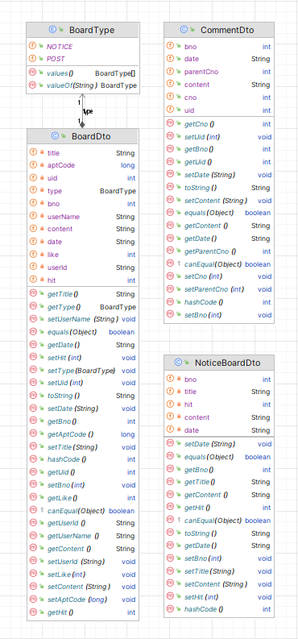
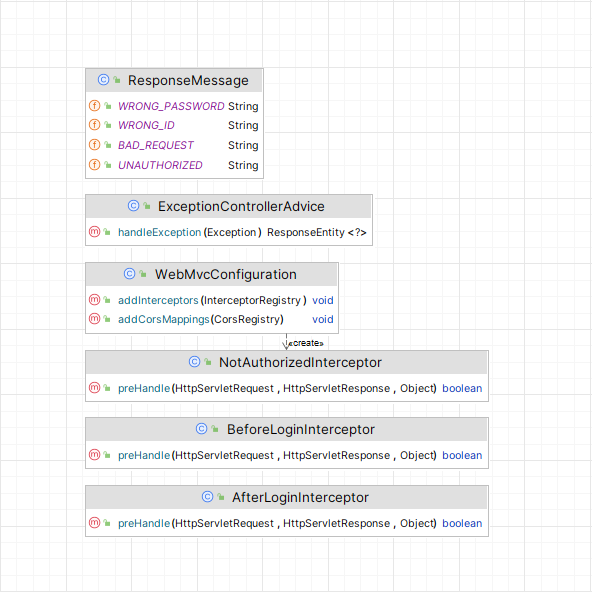

# pjt_daejeon_10th_class8_final_team04 (김태희, 오상훈)

### 아파트 부동산 거래 내역 조회 서비스 : 어제의 집

 

## 설계서

### 목차

1. 요구사항 정의서(Usecase Diagram)
2. 테이블 구조도(ERD)
3. 클래스 다이어그램
   - Back-End
   - Front-End
4. 화면 설계서 등

   

## 1. 요구사항 정의서(Usecase Diagram)

   

## 2. 테이블 구조도(ERD)

   

## 3. 클래스 다이어그램

### Back-End

- UserLogic : 로그인 
  

- UserModel : 로그인 관련 DTO 
  

- HouseLogic : 아파트 거래 정보 
  

- HouseModel : 아파트 거래 정보 관련 DTO 
  

- BoardLogic : 게시판 
  

- BoardModel : 게시판 관련 DTO 
  

- Exception and Inteceptor : 예외 처리 및 인터셉터 
  

   

### Front-End

   

## 4. 화면 설계서

### 사이트 맵

   

### 메인화면 

 

1. 로그인 페이지로 이동
2. 회원가입 페이지로 이동
3. 검색 날짜 범위 설정
4. 법정동(동이름) 검색어 추천
5. 아파트 거래내역 조회
6. 공지사항
7. 뉴스 크롤링 제공   
검색 날짜 범위 설정
 

   

### 로그인 

 

1. 아이디 / 비밀번호를 통해 로그인
2. 회원가입 페이지 이동
  

   

### 회원가입 

 

1. 아이디 / 닉네임 / 비밀번호/ 비밀번호 확인을 통해 회원가입(비밀번호 확인 기능)
2. 로그인 페이지로 이동
  

   

### 아파트 매매정보 

 

1. 드랍 메뉴
2. 아파트 이름으로 검색
3. 아파트 거래 내역 리스트
4. 아파트 거래 내역의 아파트 위치
 

   

### 아파트 이름으로 검색 

 

1. 드롭 박스
2. 정보 수정하기로 이동하기
3. 로그아웃
4. 회원 탈퇴
   

회원 정보 수정(현재 비밀번호 및 새 비밀펀호 확인 기능)
 

   

### 아파트 거래 상세 내역 

 

1.  아파트 이름, 가격, 거래일 제공 및 클릭 이벤트 작동시 아파트 주변 로드뷰 제공
2.  아파트 주변 1km 범위 도식 및 마커 클릭시 오버레이 제공
3.  주변 아파트 거래내역의 평균과 현재 아파트 거래내역의 점수 비교 및 주변 시설 종류 및 수에 대한 정보 제공
4.  아파트 거래 상세 내역으로 준공연도, 거래일, 도로명주소, 정보
      
    로드뷰 
    

      
    주변 매물 평균 과 아파트 거래내역 비교 및 주변 시설 개수를 종합한 총합점수 제공 
    

 

   

### 매물 이모저모 및 근처 다른 매물 

 

1. 매물 이모저모(게시판) : 아파트별 게시판 커뮤니티 기능 제공
2. 게시판 수정으로 이동
3. 게시판 삭제
4. 현재 아파트 주변 1km 반경 근처 다른 매물 정보 제공   
   
   게시판 수정 기능 제공
      
   
   근처 다른 매물과 현재 매물의 정보비교 제공 및 다른 매물의 거래 내역들 제공
