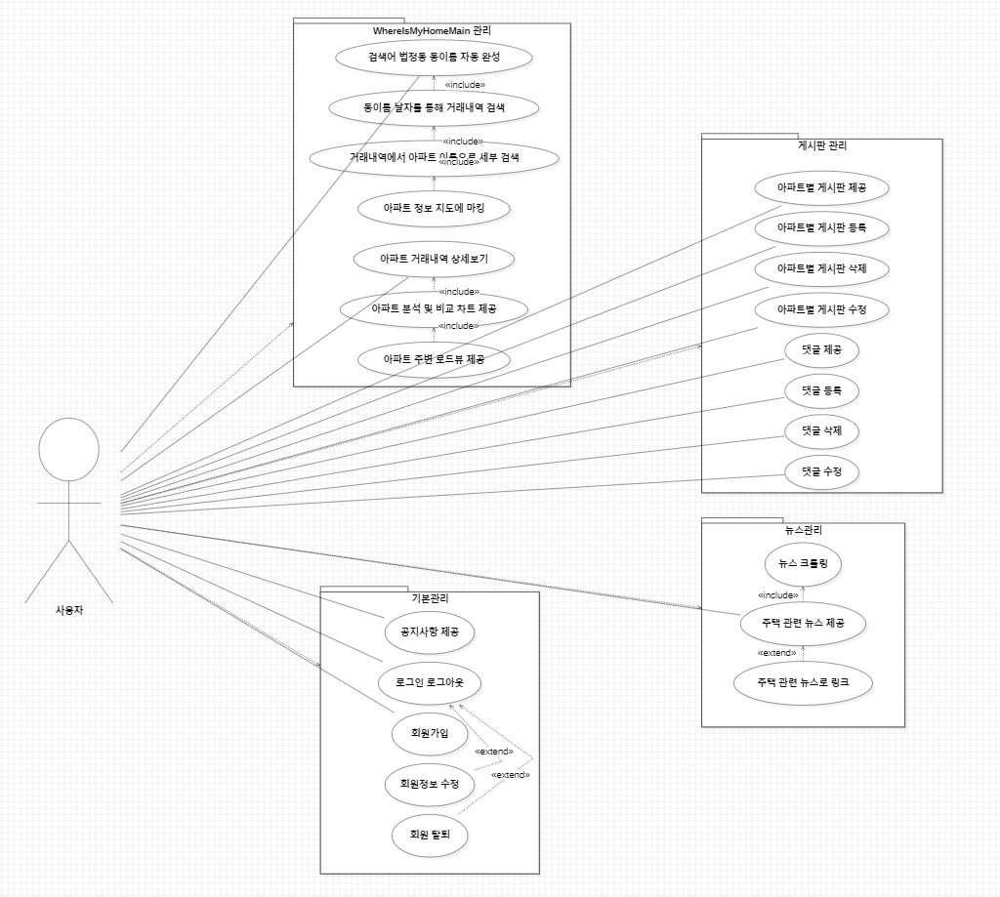
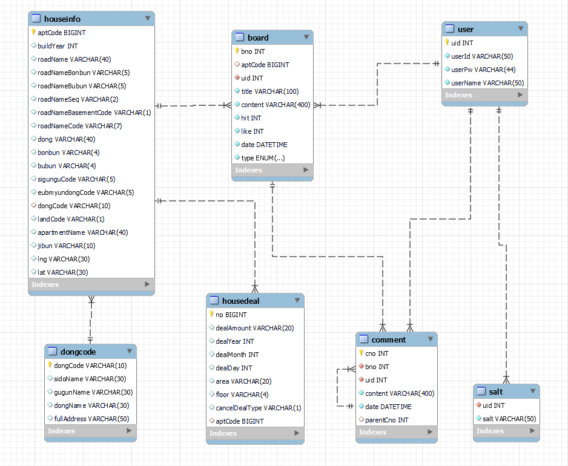

# pjt_daejeon_10th_class8_final_team04 (김태희, 오상훈)

아파트 부동산 거래 내역 조회 서비스 : (이름 미정)
   

## 설계서

### 목차

1. 요구사항 정의서(Usecase Diagram)
2. 테이블 구조도(ERD)
3. 클래스 다이어그램
4. 화면 설계서 등

   

## 1. 요구사항 정의서(Usecase Diagram)

   

## 2. 테이블 구조도(ERD)

   

## 3. 클래스 다이어그램

### Back-End

height="50%">

- UserLogic : 로그인

   

## 4.

   
