<h1 align="center">10th 대전 8반 4팀(김태희, 오상훈)</h1>
<h4 align="center">아파트 부동산 거래 내역 조회 서비스</h4>

## SpringBoot REST API Project

1. **파일 구조**
2. **요청 명세서**
3. **요청 결과**
4. **코드**

<br><hr>

### 1. 파일 구조

<p align="center">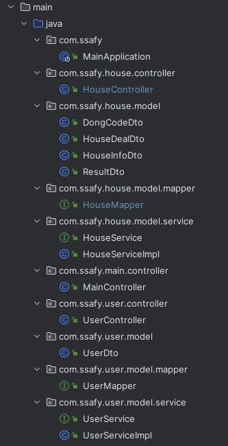</p>

<br><hr>

### 2. 요청 명세서

| service                  | HTTP method | url                                   | controller      | 상태     |
| ------------------------ | ----------- |---------------------------------------| --------------- | -------- |
| Search User By Id        | GET         | /user/{id}                            | UserController  | Complete |
| Regist User              | POST        | /user                                 | UserController  | Complete |
| Modify User              | PUT         | /user                                 | UserController  | Complete |
| Delete User By Id        | DELETE      | /user/{id}                            | UserController  | Complete |
| Search All Users         | GET         | /users                                | UserController  | Complete |
| Login                    | POST        | /login                                | LoginController | Complete |
| Logout                   | GET         | /logout                               | LoginController | Complete |
| Search House By AptName  | GET         | /house/apt?keyword=?&year=?&month=?   | HouseController | Complete |
| Search House By DongName | GET         | /house/dong?keyword=?&year=?&month=?  | HouseController | Complete |

<br><hr>

### 3. 요청 결과

<!-- 1. **Main Page** (X)

   <br><br><br><br>

2. **User Info Page** (X)

   <br><br><br><br> -->

1.  **Search User By UserId**

    _Success_<br><br>
    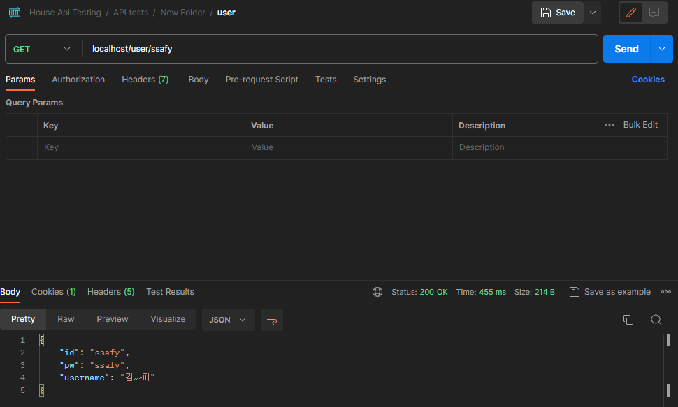
    <br><br><br>
    _Fail_<br><br>
    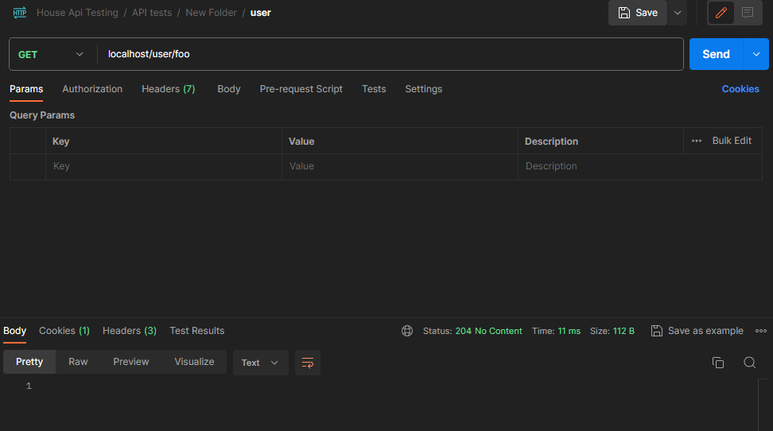

    <br><br><br><br>

2.  **Regist User**

    _Success_<br><br>
    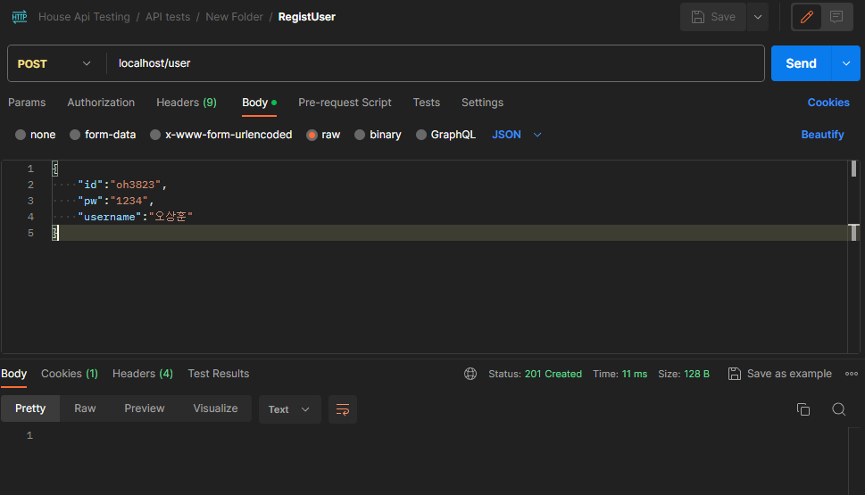
    <br><br><br>
    _Fail_<br><br>
    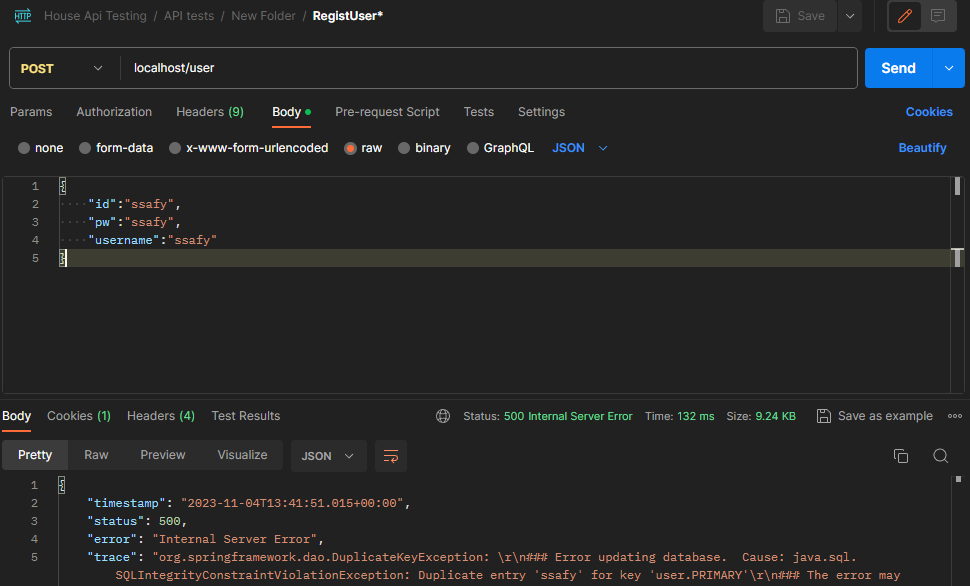

    <br><br><br><br>

3.  **Edit User**

    _Success_<br><br>
    
    <br><br><br>
    _Fail_<br><br>
    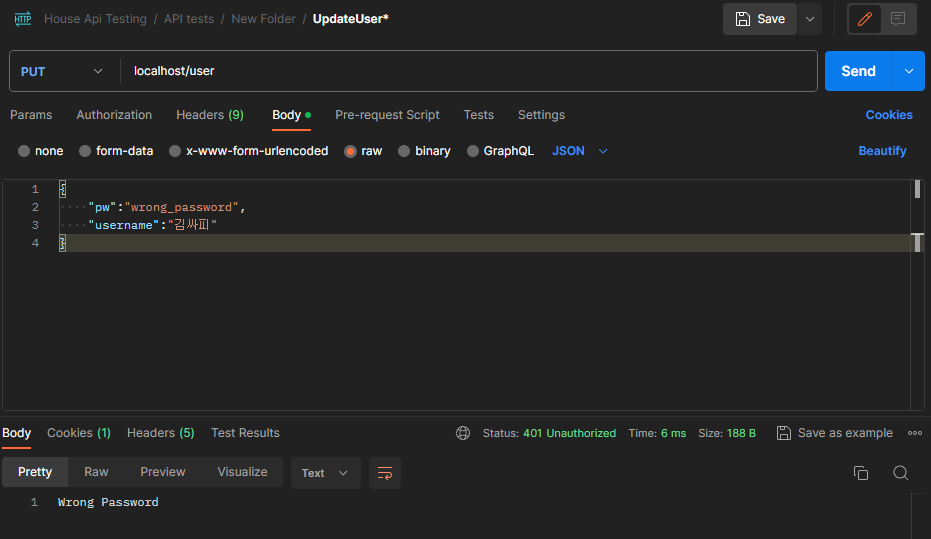

    <br><br><br><br>

4.  **Delete User**

    _Success_<br><br>
    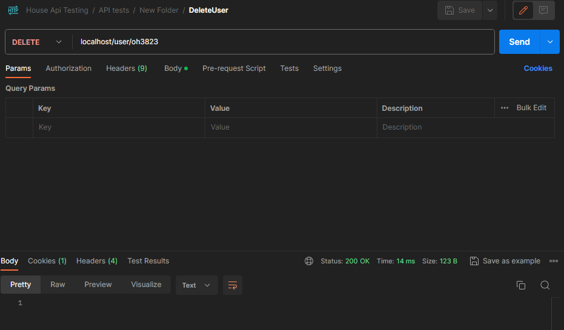
    <br><br><br>
    _Fail_<br><br>
    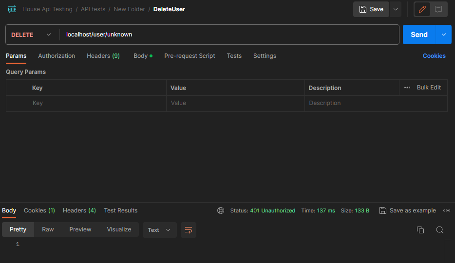

    <br><br><br><br>

5.  **Search Users**

    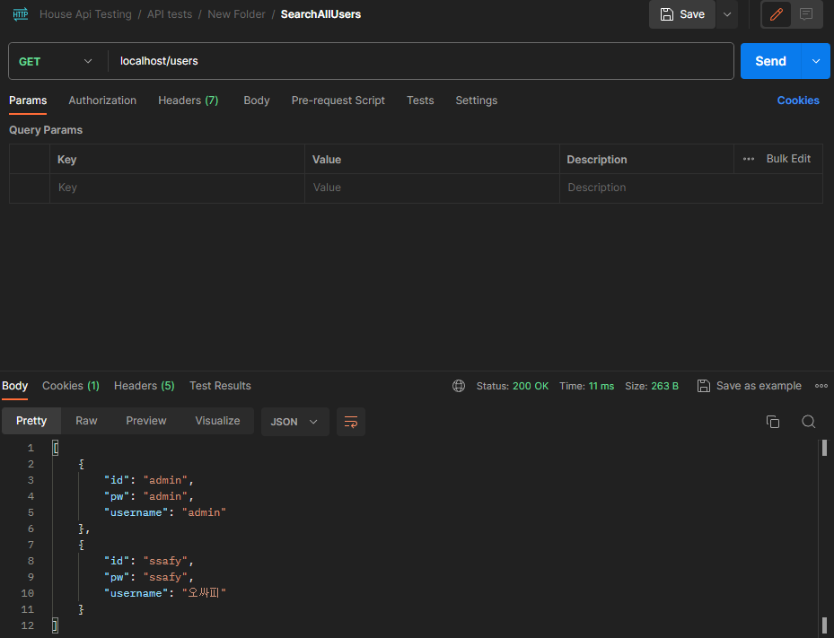

    <br><br><br><br>

6.  **Login**

    _Success_<br><br>
    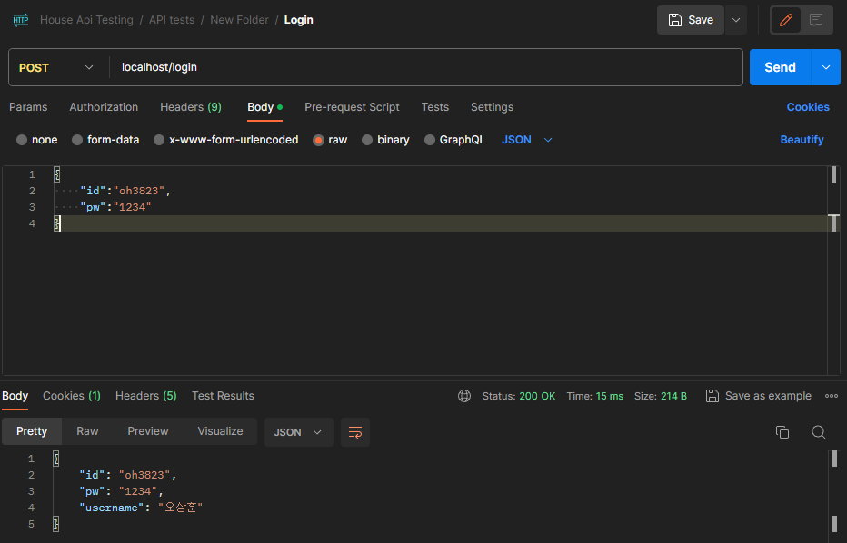
    <br><br><br>
    _Fail(WrongPw)_<br><br>
    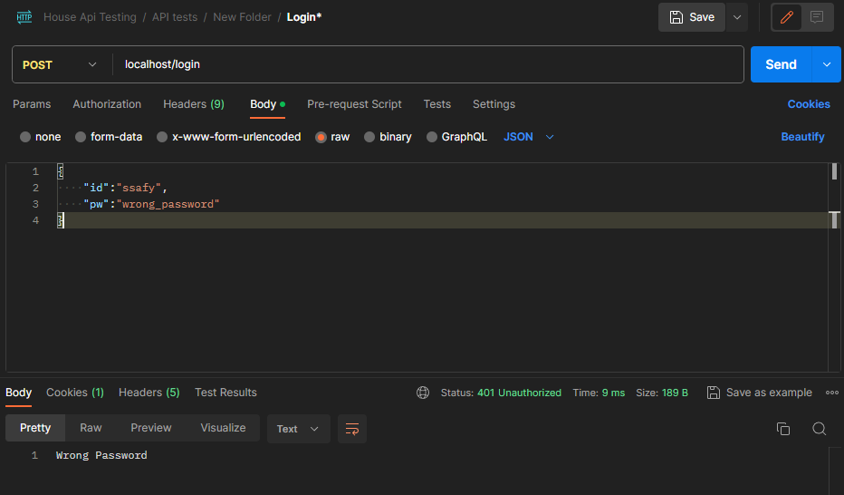
    <br><br><br>
    _Fail(WrongId)_<br><br>
    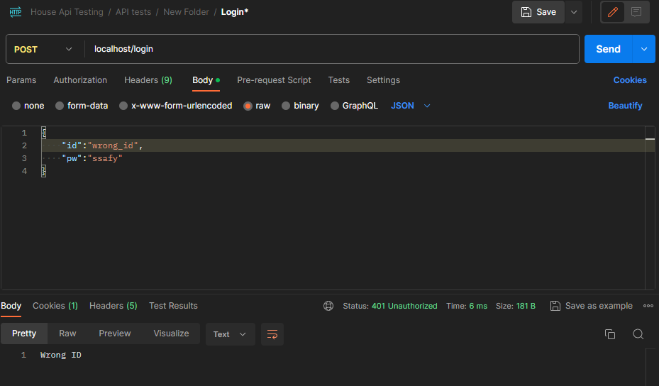

    <br><br><br><br>

7.  **Logout**

    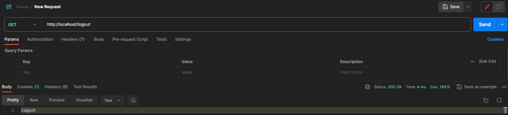

    <br><br><br><br>
    <!-- 10. **House Search Page** (X)
        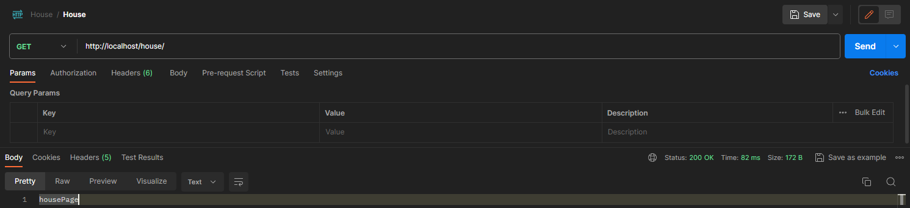
        <br><br><br><br> -->

8.  **House Search By AptName**

    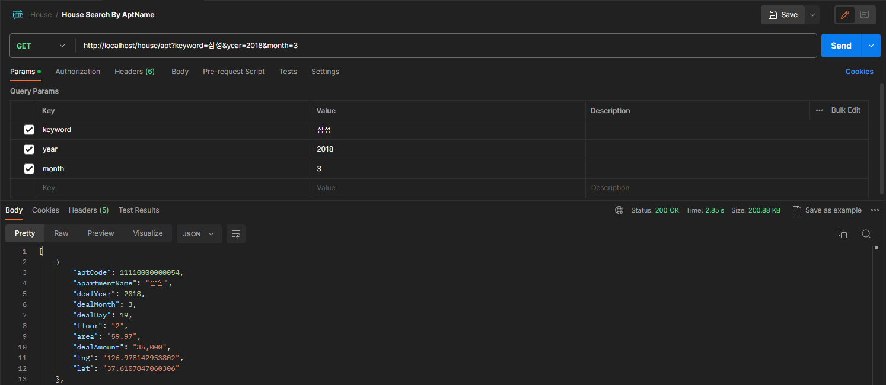

    <br><br><br><br>

9.  **House Search By DongName**

    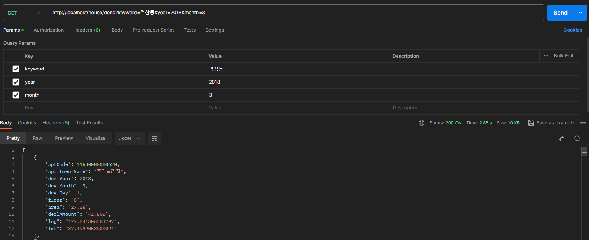

    <br><br><br><br>

<br><hr>

### 4. 코드

1. **User Search By UserId**

- UserController

```java
    @GetMapping("/user/{id}")
    public ResponseEntity<?> searchById(@PathVariable String id) throws SQLException {
        UserDto result = service.getUserById(id);

        if (result == null) return new ResponseEntity<Void>(HttpStatus.NO_CONTENT);
        return new ResponseEntity<UserDto>(result, HttpStatus.OK);
    }
```

- UserMapper

```java
    @Select("select id, pw, username from where id='${id}'")
    UserDto selectUserInfo(String id) throws SQLException;
```

<br><br><br><br>

2. **Regist User**

- UserController

```java
    @PostMapping("/user")
    public ResponseEntity<?> regist(@RequestBody UserDto user, HttpSession session) throws SQLException {
        int result = service.regist(user);
        session.setAttribute("userInfo", user);
        return new ResponseEntity<>(HttpStatus.CREATED);
    }
```

- UserMapper

```java
    @Insert("insert into user values('${id}', '${pw}', '${username}')")
    int insertUser(UserDto user) throws SQLException;
```

<br><br><br><br> 

3. **Modify User**

- UserController

```java
    @PutMapping("/user")
    public ResponseEntity<?> modify(@RequestBody UserDto user, HttpSession session) throws SQLException {
        // TODO: 권한 없는 사용자의 요청은 interceptor를 이용해서 전처리
        UserDto userInfo = (UserDto) session.getAttribute("userInfo");
        if (userInfo == null)
            return new ResponseEntity<>(HttpStatus.UNAUTHORIZED);

        if (!userInfo.getPw().equals(user.getPw()))
            return new ResponseEntity<>("Wrong Password", HttpStatus.UNAUTHORIZED);

        user.setId(userInfo.getId());
        int result = service.edit(user);
        session.setAttribute("userInfo", user);
        return new ResponseEntity<>(HttpStatus.OK);
    }
```

- UserMapper

```java
    @Update("update user set pw='${pw}', username='${username}' where id='${id}'")
    int updateUser(UserDto user) throws SQLException;
```

<br><br><br><br>

4. **Delete User By Id**

- UserController

```java
    @DeleteMapping("/user/{id}")
    public ResponseEntity<?> delete(@PathVariable String id, HttpSession session) throws SQLException {
        UserDto userInfo = (UserDto) session.getAttribute("userInfo");

        if (userInfo == null || !id.equals(userInfo.getId()))
            return new ResponseEntity<>(HttpStatus.UNAUTHORIZED);

        int result = service.deleteUserById(id);
        session.invalidate();
        return new ResponseEntity<>(HttpStatus.OK);
    }
```

- UserMapper

```java
    @Delete("delete from user where id='${id}' and pw='${pw}'")
    int deleteUser(UserDto user) throws SQLException;
```

<br><br><br><br>

5. **Search All Users**

- UserMapper

```java
    @Select("select id, pw, username from user")
    List<UserDto> selectAllUsers() throws SQLException;
```

<br><br><br><br>

6. **Login**

- MainController

```java
    @PostMapping("/login")
    public ResponseEntity<?> login(@RequestBody UserDto user, HttpSession session) throws SQLException {
        System.out.println(user.getId());
        UserDto loginUser = userService.getUserById(user.getId());

        // 로그인 실패
        if (loginUser == null) {
            return new ResponseEntity<String>("Wrong ID", HttpStatus.UNAUTHORIZED);
        } else if (!loginUser.getPw().equals(user.getPw())) {
            return new ResponseEntity<String>("Wrong Password ", HttpStatus.UNAUTHORIZED);
        }

        session.setAttribute("userInfo", loginUser);
        return new ResponseEntity<UserDto>(loginUser, HttpStatus.OK);
    }
```

- UserMapper

```java
    @Select("select id, pw, username from user where id='${id}' and pw='${pw}'")
    UserDto selectOneUser(UserDto user) throws SQLException;
```
<br><br><br><br> 

7. **Logout**

- UserController

```java
    @GetMapping("/logout")
    public ResponseEntity<?> logout(HttpSession session) {
        System.out.println("로그 아웃");
        session.removeAttribute("userInfo");
        return new ResponseEntity<String>("logout", HttpStatus.OK);
    }
```
<br><br><br><br>

8. **House Search By AptName**

- HouseController

```java
@GetMapping("/apt")
public ResponseEntity<?> getAptByName(String keyword, int year, int month){
        System.out.println("getAptByName");
        // 날짜 + 아파트 이름
        HouseInfoDto houseInfoDto = new HouseInfoDto();
        houseInfoDto.setApartmentName(keyword);

        HouseDealDto houseDealDto = new HouseDealDto();
        houseDealDto.setDealYear(year);
        houseDealDto.setDealMonth(month);

        try {
        List<ResultDto> result =  houseService.getAptByName(houseInfoDto, houseDealDto);
            if(result != null && !result.isEmpty()) {
                return new ResponseEntity<List<ResultDto>>(result, HttpStatus.OK);
            } else {
                return new ResponseEntity<Void>(HttpStatus.NO_CONTENT);
            }
        } catch (Exception e) {
            return exceptionHandling(e);
        }

}
```

- HouseMapper

```java
@Select("SELECT hi.aptCode, hi.apartmentName, hd.dealYear, hd.dealMonth, hd.dealDay, hd.floor, hd.area, hd.dealAmount, hi.lng, hi.lat " +
        "FROM housedeal AS hd INNER JOIN houseinfo AS hi " +
        "    ON hd.aptCode = hi.aptCode " +
        "WHERE hi.apartmentName like '%${info.apartmentName}%' and hd.dealYear = ${deal.dealYear} and hd.dealMonth = ${deal.dealMonth}")
@ResultType(ResultDto.class)
List<ResultDto> getAptByName(@Param("info") HouseInfoDto houseInfoDto, @Param("deal") HouseDealDto houseDealDto);

```

<br><br><br><br> 
9. **House Search By DongName**

- HouseController

```java
@GetMapping("/dong")
public ResponseEntity<?> getAptByDong(String keyword, int year, int month){
        System.out.println("getAptByDong");
        // 날짜 + 동이름
        DongCodeDto dongCodeDto = new DongCodeDto();
        dongCodeDto.setDongName(keyword);

        HouseDealDto houseDealDto = new HouseDealDto();
        houseDealDto.setDealYear(year);
        houseDealDto.setDealMonth(month);

        try {
            List<ResultDto> result =  houseService.getAptByDong(dongCodeDto, houseDealDto);
            if(result != null && !result.isEmpty()) {
                return new ResponseEntity<List<ResultDto>>(result, HttpStatus.OK);
            } else {
                return new ResponseEntity<Void>(HttpStatus.NO_CONTENT);
            }
        } catch (Exception e) {
            return exceptionHandling(e);
        }
}

```

- HouseMapper

```java
@Select("SELECT i.aptCode, i.apartmentName, h.dealYear, h.dealMonth, h.dealDay, h.floor, h.area, h.dealAmount, i.lng, i.lat " +
            "FROM housedeal AS h " +
            "    INNER JOIN houseinfo AS i " +
            "        ON h.aptCode = i.aptCode " +
            "    INNER JOIN dongcode AS d " +
            "        ON i.dongCode = d.dongCode " +
            "WHERE d.dongName = '${dong.dongName}' AND h.dealYear = ${deal.dealYear} AND h.dealMonth = ${deal.dealMonth};")
@ResultType(ResultDto.class)
List<ResultDto> getAptByDong(@Param("dong") DongCodeDto dongCodeDto, @Param("deal") HouseDealDto houseDealDto);

```
